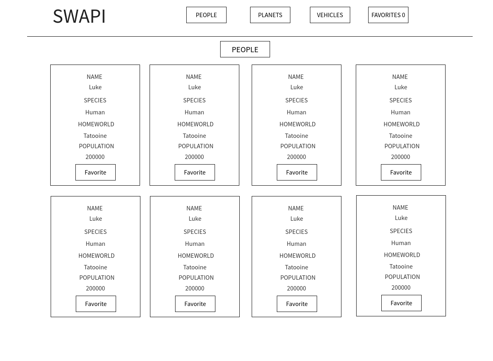

### Description

This project was built to allow users to search through and favorite their favorite Star Wars characters, planets, and vehicles. 

### Installation

In order to install and run this app on your local machine type the following in your terminal:

1. `git clone git@github.com:RyanDBarnett/swapi.git`
2. `cd swapi`
3. `npm install`
4. `npm start`

### Screenshots

#### Wire Frame

#### Finished App

### Learning Goals

The major goal of this project was to practice using asyncronous JaveScript, asyncronous testing, ReactJS, JSX, SCSS,  technologies to make an interactive app.

Other goals included, saving cards to local storage, writing DRY code, and practicing testing.
